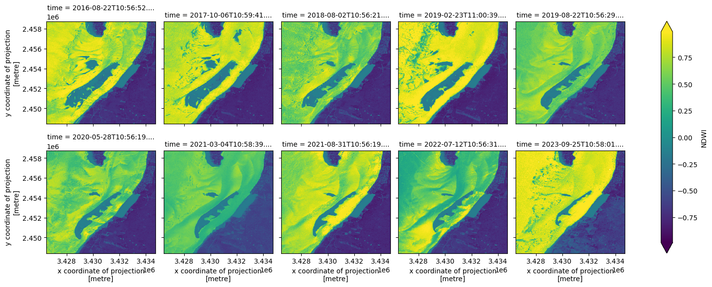
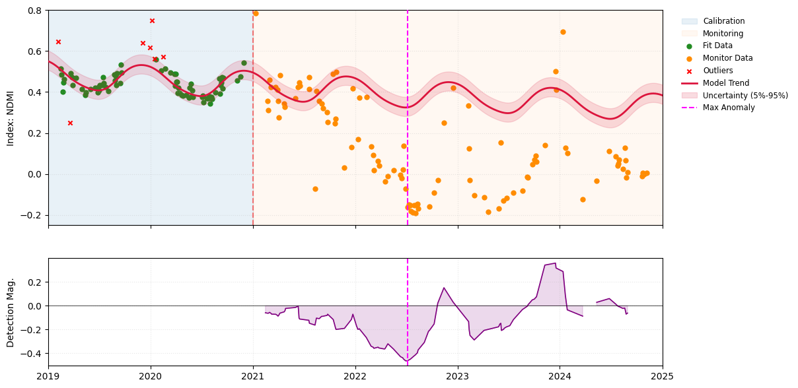
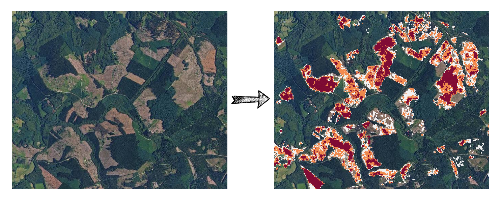
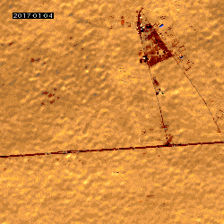
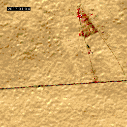
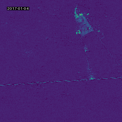

# Sits Python Package

``sits`` is a high-level Python package designed to simplify the extraction and processing of Satellite Image Time Series (SITS) referenced in STAC catalogs. For any given point or polygon, it efficiently handles data retrieval and, leveraging ``spyndex``, can calculate a wide array of spectral indices. The processed results can be exported in various formats, including image files, CSV tables, or dynamic animated GIFs, with customizable dimensions suitable for applications such as deep learning.
In addition to its core functionalities, the package includes an experimental analysis module that integrates forecasting methods from the ``sktime`` library. This module enables users to apply time series models to satellite-derived data, opening possibilities for predictive analytics and temporal pattern exploration.

---

**Automatic calculation of over 200 spectral indices offered by Spyndex**



**Anomaly detection on time series: the example of clear-cutting in forests**





**Quick and easy timelapse creation**

 



---

**GitHub**: [https://github.com/kenoz/SITS_utils](https://github.com/kenoz/SITS_utils)

**Documentation**: [https://sits.readthedocs.io/](https://sits.readthedocs.io/)

**PyPI**: [https://pypi.org/project/sits/](https://pypi.org/project/sits/)

**Tutorials**: [https://sits.readthedocs.io/en/latest/tutorials.html](https://sits.readthedocs.io/en/latest/tutorials.html)


## Installation

Use the package manager [pip](https://pip.pypa.io/en/stable/) to install [sits](https://pypi.org/project/sits/).

```bash
pip install sits 
```

## Usage

Explore the [full documentation](https://sits.readthedocs.io/en/latest/index.html) for a complete description of features. To get started quickly, you can also run through the interactive [tutorials](https://sits.readthedocs.io/en/latest/tutorials.html) via your favorite notebook platform or Google Colab.

## Notebooks

If you want to explore the different ways to use the sits package, we recommend running the following Jupyter notebooks, in [Google Colab](https://colab.research.google.com/) for instance:

- [Example 01](https://github.com/kenoz/SITS_utils/blob/main/docs/source/tutorials/colab_sits_ex01.ipynb): explain the basics for retrieving a satellite image time series according to a polygon feature.
- [Example 02](https://github.com/kenoz/SITS_utils/blob/main/docs/source/tutorials/colab_sits_ex02.ipynb): explain how to export a satellite time series into an animated GIF or video file.
- [Example 03](https://github.com/kenoz/SITS_utils/blob/main/docs/source/tutorials/colab_sits_ex03.ipynb): explain how to compute spectral indices with `sits` and `spyndex` packages.
- [Example 04](https://github.com/kenoz/SITS_utils/blob/main/docs/source/tutorials/colab_sits_ex04.ipynb): explain how to parallelize processing tasks in case of multiple vector features.
- [Example 05](https://github.com/kenoz/SITS_utils/blob/main/docs/source/tutorials/colab_sits_ex05.ipynb): explain how to automatically detect forest clear-cuts by using the ``analysis`` module.

## Contributing

Pull requests are welcome. For major changes, please open an issue first
to discuss what you would like to change.

Please make sure to update tests as appropriate.

### Testing

To ensure the correct behaviour of the module, you can run:

```bash
# Or any of the supported python versions
uv run --python 3.10 --group dev pytest tests/

```

If you want to test all the supported python versions, you can run `./test_all_versions.sh`.

If you want an isolated environment, you can use the `Dockerfile` provided.

To run the matrix test in the isolated environment you can do:

```bash
# Build the image
docker build -t sits-gdal .

# Then run the tests with persistent caching
docker run --rm \
  -v uv-cache:/root/.cache/uv \
  sits-test


```

Or if you want to test live changes, you can Bind Mount your working directory as:
 
```bash
# Run this AFTER building the image
docker run --rm \
  -v uv-cache:/root/.cache/uv \
  -v $(pwd):/app \
  sits-test


```
Remember that if you make changes to the Dockerfile, you will need to build your image again.


## License

[GNU GPL v.3.0](LICENSE)
