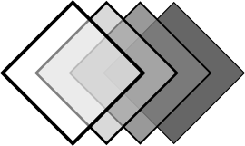

.. sits documentation master file, created by
   sphinx-quickstart on Mon Aug  5 09:54:12 2024.
   You can adapt this file completely to your liking, but it should at least
   contain the root `toctree` directive.

Welcome to sits's documentation!
================================

.. toctree::
   :maxdepth: 2
   :caption: Contents:

   intro
   sits
   examples

Indices and tables
==================

* :ref:`genindex`
* :ref:`modindex`
* :ref:`search`
